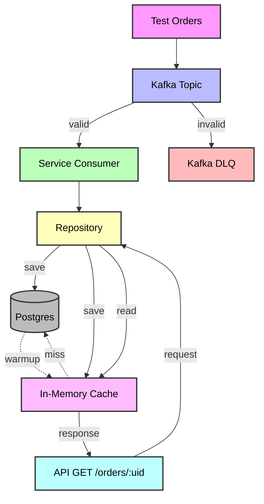

# 📦 Order Service

## ✨ Description
This project is a service for processing orders.  

### 🔑 Key features:
-  Receiving and storing orders via **Kafka**.  
-  **Dead Letter Queue (DLQ)**: invalid orders are redirected to a separate Kafka topic.  
-  **Caching** orders for fast access (cache size is configurable in `.env`).  
-  **REST API**: retrieve orders by UID → `GET /orders/:uid`.  
-  Generate test orders (valid ✅ and invalid ❌).  
- **Graceful shutdown** of the HTTP server and Kafka consumer.  
-  **Flexible logging**: configure **log level** and **output format (JSON or text)** via `.env`.  
- **Cache warm-up on startup**: preloads recent orders from the database into the cache for faster first access.


---

## ⚙️ Prerequisites
- 🐳 Docker & Docker Compose  
- 🐹 Go (1.25.0)  

📍 **Service endpoint:**  
- http://localhost:8081/orders/:uid  

📊 **Kafka UI:**  
- http://localhost:8080  

---




## 🚀 Installation and Run

### 1️⃣ Clone the repository and configure `.env`

### 2️⃣ Build and start all services
```bash
make up
```
#### 3️⃣ Run the service and create the Kafka topic "orders":
```bash
make run
```
#### 4️⃣ In another terminal, you can send and retrieve orders using the scripts and generated test orders:
```bash
make post-get-order
```

